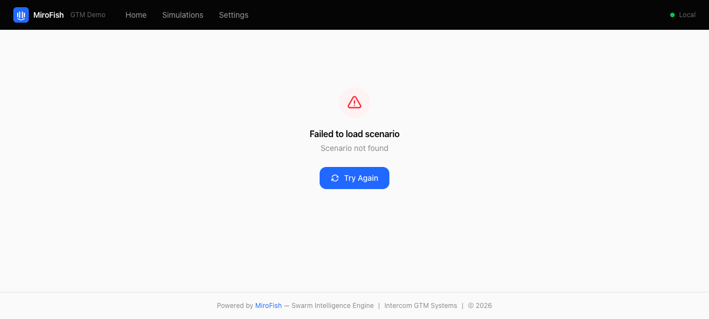
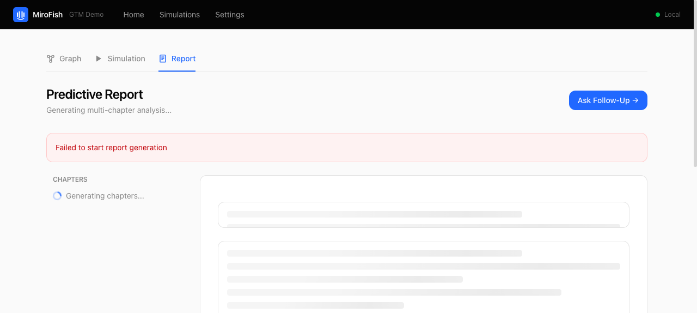
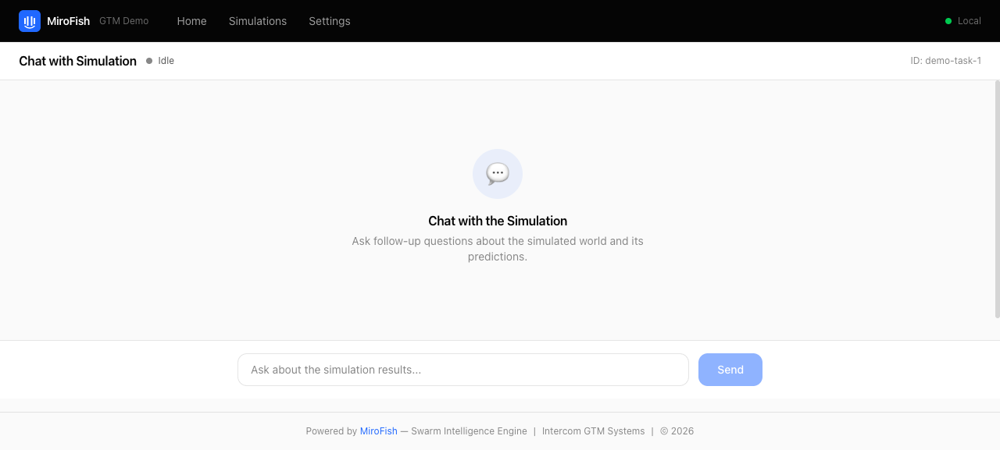
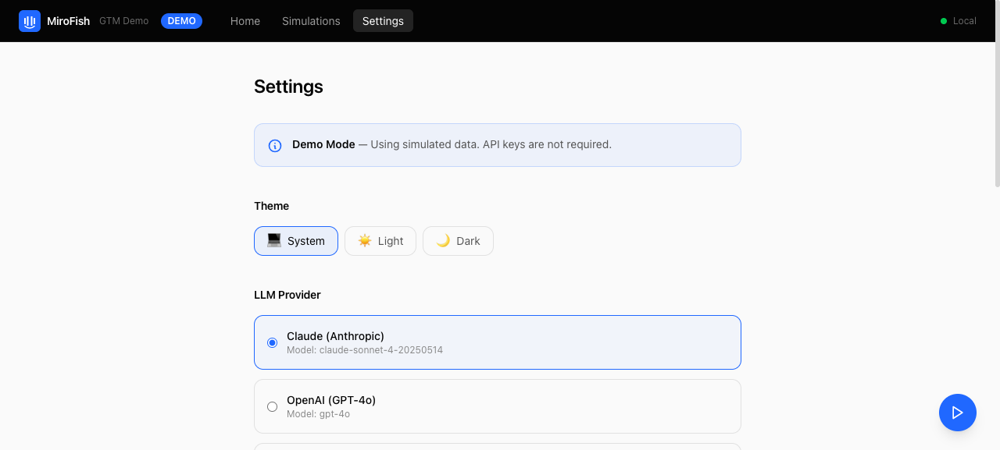

# MiroFish for GTM — Swarm Intelligence Demo

> Predict campaign outcomes before they happen. Simulate how prospects react to your outbound, signals, and pricing changes.

[](LICENSE)
[](https://python.org)
[](https://nodejs.org)
[](docker-compose.yml)

An Intercom-branded fork of [MiroFish](https://github.com/666ghj/MiroFish) — an open-source swarm intelligence engine (40K+ GitHub stars) — customized for Intercom's GTM Systems team. Pre-test automated outbound campaigns, validate sales signals, simulate pricing changes, and optimize personalization before they hit real prospects.

---

## Table of Contents

- [The Problem](#the-problem)
- [The Solution](#the-solution)
- [Screenshots](#screenshots)
- [Features](#features)
- [Quick Start](#quick-start)
- [Configuration](#configuration)
- [Architecture](#architecture)
- [GTM Scenarios](#gtm-scenarios)
- [Development Guide](#development-guide)
- [Deployment to Railway](#deployment-to-railway)
- [API Reference](#api-reference)
- [Contributing](#contributing)
- [License](#license)
- [Credits](#credits)

---

## The Problem

Intercom's GTM operations face a fundamental challenge: **we can't predict how our outbound messaging, pricing changes, and campaign strategies will land before we execute them.**

| Challenge | Impact |
|-----------|--------|
| Data trust is critically low | Reps spend 5-30 minutes per account validating data |
| 56K incorrect website records | Enrichment accuracy only 25-32% |
| Signal adoption collapsed | 11% unactioned at launch to 76% now |
| No campaign staging environment | Every campaign is a production deployment |
| Churn prediction: 87% recall, 16% precision | Model predicts who, not how to prevent |

## The Solution

MiroFish creates **digital sandboxes** populated with AI agents that simulate real social behavior. Instead of asking "what happened last time?" it answers **"what would happen if we did this?"**

```
Your Scenario (email copy, signals, pricing)
    -> Knowledge Graph Construction (Zep GraphRAG)
        -> Agent Population (hundreds of AI personas)
            -> Social Simulation (Twitter + Reddit, 23 action types)
                -> Predictive Report (evidence-based analysis)
                    -> Interactive Chat (Q&A with simulated world)
```

---

## Screenshots

> Screenshots will be added after the first full simulation run.

| View | Description |
|------|-------------|
| **Landing** | Welcome page with feature overview and scenario quick-start |
| **Scenario Builder** | Select pre-built GTM scenarios or upload custom seed text |
| **Knowledge Graph** | D3.js force-directed graph with zoom/pan and entity details |
| **Simulation** | Live agent action timeline with round-by-round progress |
| **Report** | Predictive analysis with key findings, charts, and recommendations |
| **Chat** | Interactive Q&A with the simulated world using Report Agent |
| **Settings** | LLM provider selection, auth configuration, and system status |

<!--
To add screenshots, place images in a docs/screenshots/ directory and update paths:







-->

---

## Features

- **4 Pre-Built GTM Scenarios** — Outbound campaign pre-testing (hero), signal validation, pricing simulation, personalization optimization
- **Multi-LLM Support** — Claude (Anthropic), OpenAI (GPT-4o), Google Gemini — switchable in settings
- **Intercom Branding** — Full Intercom design language with brand colors (#2068FF blue, #050505 navy, #ff5600 Fin orange), typography, and logo
- **Real GTM Seed Data** — Anonymized data from Intercom's actual GTM models (accounts, signals, templates, personas)
- **7 Interactive Views** — Landing, Scenario Builder, Knowledge Graph, Live Simulation, Report Explorer, Chat, Settings
- **Knowledge Graph Visualization** — D3.js force-directed graphs with zoom, pan, and entity detail inspection
- **Report Agent** — AI-powered analysis agent that autonomously searches the knowledge graph to generate evidence-based reports
- **Agent Interviews** — Chat directly with individual simulated agents after a simulation completes
- **Optional Auth** — Google OAuth / Okta SSO with @intercom.io email enforcement (toggle via `.env`)
- **Docker Deployment** — Single `docker compose up` for Railway or local development

---

## Quick Start

### Prerequisites

- **Docker** (recommended) or:
  - Python 3.11+ with [uv](https://docs.astral.sh/uv/) package manager
  - Node 18+ with [pnpm](https://pnpm.io/)
- **API Keys:**
  - An LLM API key (Anthropic, OpenAI, or Google)
  - A [Zep Cloud](https://app.getzep.com/) API key (free tier sufficient for PoC)

### Docker (Recommended)

```bash
git clone https://github.com/intercom/gtm-mirofish-demo.git
cd gtm-mirofish-demo
cp .env.example .env
# Edit .env — set LLM_API_KEY and ZEP_API_KEY at minimum
docker compose up -d
```

- **Frontend:** http://localhost:3000
- **Backend:** http://localhost:5001
- **Health check:** http://localhost:5001/health

### Manual Development

```bash
# 1. Clone and configure
git clone https://github.com/intercom/gtm-mirofish-demo.git
cd gtm-mirofish-demo
cp .env.example .env
# Edit .env with your API keys

# 2. Backend (terminal 1)
cd backend
uv sync
uv run python run.py
# Backend runs on http://localhost:5001

# 3. Frontend (terminal 2)
cd frontend
pnpm install
pnpm dev
# Frontend runs on http://localhost:3000
```

### Verify Installation

```bash
# Check backend health
curl http://localhost:5001/health
# Expected: {"status":"ok","service":"MiroFish Backend"}

# List available GTM scenarios
curl http://localhost:5001/api/gtm/scenarios
```

---

## Configuration

All configuration is via the `.env` file. Copy [.env.example](.env.example) to get started.

### LLM Provider

| Variable | Required | Default | Description |
|----------|----------|---------|-------------|
| `LLM_PROVIDER` | Yes | `anthropic` | LLM provider: `anthropic`, `openai`, or `gemini` |
| `LLM_API_KEY` | Yes | — | API key for the chosen provider |
| `LLM_BASE_URL` | No | Auto-configured | Override the provider's default base URL |
| `LLM_MODEL_NAME` | No | Auto-configured | Override the provider's default model |

Auto-configured defaults per provider:

| Provider | Base URL | Default Model |
|----------|----------|---------------|
| `anthropic` | `https://api.anthropic.com/v1/` | `claude-sonnet-4-20250514` |
| `openai` | `https://api.openai.com/v1/` | `gpt-4o` |
| `gemini` | `https://generativelanguage.googleapis.com/v1beta/openai/` | `gemini-2.5-flash` |

### Knowledge Graph

| Variable | Required | Default | Description |
|----------|----------|---------|-------------|
| `ZEP_API_KEY` | Yes | — | [Zep Cloud](https://app.getzep.com/) API key (free tier available) |

### Authentication (Optional)

| Variable | Required | Default | Description |
|----------|----------|---------|-------------|
| `AUTH_ENABLED` | No | `false` | Enable OAuth login gate |
| `AUTH_PROVIDER` | No | `google` | OAuth provider: `google` or `okta` |
| `AUTH_ALLOWED_DOMAIN` | No | `intercom.io` | Restrict login to this email domain |
| `GOOGLE_CLIENT_ID` | No | — | Google OAuth 2.0 client ID |
| `GOOGLE_CLIENT_SECRET` | No | — | Google OAuth 2.0 client secret |
| `OKTA_ISSUER` | No | — | Okta SSO issuer URL |
| `OKTA_CLIENT_ID` | No | — | Okta client ID |

### Accelerated LLM (Optional)

| Variable | Required | Default | Description |
|----------|----------|---------|-------------|
| `LLM_BOOST_API_KEY` | No | — | Separate LLM key for parallel processing |
| `LLM_BOOST_BASE_URL` | No | — | Base URL for boost provider |
| `LLM_BOOST_MODEL_NAME` | No | — | Model name for boost provider |

### Server

| Variable | Required | Default | Description |
|----------|----------|---------|-------------|
| `BACKEND_PORT` | No | `5001` | Flask backend port |
| `FRONTEND_PORT` | No | `3000` | Vite dev server port |
| `FLASK_DEBUG` | No | `true` | Enable Flask debug mode |
| `SECRET_KEY` | No | `change-me-in-production` | Flask session secret key |

---

## Architecture

```
                          +-----------------------------------------+
                          |              Frontend (Vue 3)            |
                          |  Vite + Tailwind + Pinia + D3.js        |
                          |  Port 3000                              |
                          +---+-----+-----+-----+-----+-----+------+
                              |     |     |     |     |     |
                         /api/graph  |  /api/sim |  /api/report  /api/gtm
                              |     |     |     |     |     |
                          +---v-----v-----v-----v-----v-----v------+
                          |             Backend (Flask)             |
                          |  OASIS Simulation + Zep GraphRAG        |
                          |  Port 5001                              |
                          +-----+-------------+-------------+------+
                                |             |             |
                          +-----v-----+ +----v------+ +----v------+
                          | Zep Cloud | | LLM API   | | GTM Seed  |
                          | (GraphRAG | | Claude /  | | Data      |
                          |  Memory)  | | GPT / Gem | | (JSON)    |
                          +-----------+ +-----------+ +-----------+
```

### Data Flow

```
1. UPLOAD        User selects scenario or uploads custom seed text
                       |
2. GRAPH BUILD   Text -> chunks -> Zep Cloud -> knowledge graph
                       |
3. SIMULATE      Graph entities -> OASIS agent personas
                 Agents interact on simulated Twitter/Reddit (23 action types)
                       |
4. REPORT        Report Agent searches graph + simulation data
                 Generates evidence-based predictive analysis
                       |
5. INTERVIEW     User chats with individual agents or the Report Agent
```

### Tech Stack

| Component | Technology |
|-----------|-----------|
| Frontend | Vue 3.5 + Vite 8 + Tailwind CSS 4 + Pinia 3 + Vue Router 4 |
| Visualization | D3.js v7 (force-directed knowledge graphs) |
| Markdown | Marked 17 (report rendering) |
| HTTP Client | Axios 1.13 |
| Backend | Flask 3.0+ (Python 3.11+) |
| Simulation | OASIS (camel-oasis 0.2.5) — up to 1M agents |
| Memory | Zep Cloud 3.13 (temporal knowledge graphs) |
| LLM | Any OpenAI-compatible API (via openai SDK) |
| File Processing | PyMuPDF (PDF), charset-normalizer (encoding) |
| Validation | Pydantic 2.0+ |
| Auth | Google OAuth / Okta SSO (optional) |
| Package Mgmt | uv (Python), pnpm (Node) |
| Deploy | Docker Compose + Railway |

---

## GTM Scenarios

Four pre-built scenarios are available in `backend/gtm_scenarios/`. Each includes seed text, agent persona definitions, and simulation configuration.

### 1. Outbound Campaign Pre-Testing (Hero)

Simulate how AI-generated outbound emails land with synthetic prospect populations.

- **Agent count:** 200 personas (VP of Support, CX Director, IT Leader, Head of Operations)
- **Seeds with:** Email copy, target segment description, firmographic data
- **Key outputs:** Engagement prediction by persona, subject line effectiveness, objection mapping by industry, optimal cadence

### 2. Sales Signal Validation

Test whether sales signals actually predict buying behavior.

- **Agent count:** 500 personas across 5 decision-making roles
- **Seeds with:** 8 signal definitions from Intercom's DBT models
- **Key outputs:** Signal-to-buying correlation, false positive rates, recommended signal priority ranking

### 3. Pricing Change Simulation

Predict customer reactions to P5 pricing migration.

- **Agent count:** 500 customer personas (SMB / Mid-Market / Enterprise)
- **Seeds with:** 4 pricing scenarios and customer segment mix
- **Key outputs:** Churn probability by segment, public sentiment risk, competitive switch likelihood, optimal migration strategy

### 4. Personalization Optimization

Rank email personalization variants by simulated engagement.

- **Agent count:** 200 personas
- **Seeds with:** 10 message variants varying tone, length, personalization, and CTA
- **Key outputs:** Variant ranking by segment, most impactful personalization dimensions

### Seed Data

Anonymized GTM data is provided in `backend/gtm_seed_data/`:

| File | Contents |
|------|----------|
| `account_profiles.json` | 4 company profiles with segment, industry, ARR, health score, churn risk |
| `signal_definitions.json` | 8 sales signal types with accuracy and adoption metrics |
| `email_templates.json` | 3 outbound email templates (ROI pitch, case study, competitive displacement) |
| `persona_templates.json` | 4 buyer personas with role, priorities, objections, communication style |

---

## Development Guide

### Project Structure

```
gtm-mirofish-demo/
├── backend/                    # Flask backend (MiroFish fork)
│   ├── app/
│   │   ├── __init__.py         # Flask app factory, blueprint registration
│   │   ├── config.py           # Multi-LLM provider configuration
│   │   ├── api/
│   │   │   ├── graph.py        # Knowledge graph CRUD + build routes
│   │   │   ├── simulation.py   # OASIS simulation lifecycle routes
│   │   │   ├── report.py       # Report generation + chat routes
│   │   │   └── gtm_scenarios.py # GTM scenario template API
│   │   ├── models/             # Project + task persistence
│   │   ├── services/           # Core business logic (READ-ONLY)
│   │   └── utils/              # LLM client, file parser, logger
│   ├── auth/                   # OAuth middleware (Google/Okta)
│   ├── gtm_scenarios/          # Pre-built scenario JSON files
│   ├── gtm_seed_data/          # Anonymized GTM data
│   ├── scripts/                # Utility scripts for direct simulation
│   ├── run.py                  # Backend entry point
│   └── pyproject.toml          # Python dependencies (uv)
├── frontend/                   # Vue 3 frontend (complete rebuild)
│   ├── src/
│   │   ├── assets/
│   │   │   └── brand-tokens.css # Intercom design tokens
│   │   ├── components/layout/  # AppNav, AppFooter
│   │   └── views/              # 8 views (Landing through Settings)
│   ├── package.json
│   └── vite.config.js          # Proxy /api -> backend:5001
├── docker-compose.yml          # Two-service Docker setup
├── Dockerfile.backend          # Python 3.11 + uv
├── Dockerfile.frontend         # Node 18
└── .env.example                # All environment variables
```

### Frontend Development

The frontend is a complete Vue 3 rebuild with Intercom branding.

```bash
cd frontend
pnpm install
pnpm dev          # Dev server on http://localhost:3000
pnpm build        # Production build to dist/
pnpm preview      # Preview production build
```

**Conventions:**
- All components use Composition API with `<script setup>`
- Styling uses Tailwind CSS utility classes with brand tokens from `src/assets/brand-tokens.css`
- API requests use the `/api` prefix, which Vite proxies to the Flask backend
- State management via Pinia stores
- Routing via Vue Router

**Intercom Design Tokens:**
- Primary blue: `#2068FF`
- Navy: `#050505`
- Fin orange: `#ff5600`
- Font: system-ui stack (Segoe UI, Roboto, Helvetica, Arial)

### Backend Development

The backend is a minimally patched fork of the MiroFish Flask server.

```bash
cd backend
uv sync             # Install dependencies
uv run python run.py # Start on http://localhost:5001
```

**Conventions:**
- Services in `app/services/` are **read-only** — do not modify
- New GTM-specific routes go in `app/api/gtm_scenarios.py`
- Configuration is resolved via `app/config.py` from `.env`
- All routes return JSON with `{success: bool, data: ...}` shape
- Async operations return a `task_id` for polling via `/api/graph/task/<task_id>`

### Running Tests

```bash
# Backend
cd backend
uv run pytest

# Frontend
cd frontend
pnpm test          # If test runner is configured
```

---

## Deployment to Railway

[Railway](https://railway.app) supports multi-service Docker Compose deployments.

### Step 1: Install Railway CLI

```bash
pnpm add -g @railway/cli
```

### Step 2: Login and Initialize

```bash
railway login
railway init
```

### Step 3: Set Environment Variables

```bash
# Required
railway variables set LLM_PROVIDER=anthropic
railway variables set LLM_API_KEY=your-anthropic-key
railway variables set ZEP_API_KEY=your-zep-key

# Production auth (recommended)
railway variables set AUTH_ENABLED=true
railway variables set AUTH_PROVIDER=google
railway variables set GOOGLE_CLIENT_ID=your-client-id
railway variables set GOOGLE_CLIENT_SECRET=your-client-secret
railway variables set SECRET_KEY=$(openssl rand -hex 32)
```

### Step 4: Deploy

```bash
railway up
```

Railway will detect the `docker-compose.yml` and deploy both services. The frontend service depends on the backend and will start after it's healthy.

### Post-Deployment Checklist

- [ ] Verify `/health` endpoint returns `{"status":"ok"}`
- [ ] Confirm `AUTH_ENABLED=true` is set for production
- [ ] Set a strong `SECRET_KEY` (not the default)
- [ ] Test OAuth flow with an @intercom.io email
- [ ] Verify GTM scenarios load: `GET /api/gtm/scenarios`

---

## API Reference

All endpoints are prefixed with `/api`. The backend registers four blueprint groups:

### Health Check

| Method | Endpoint | Description |
|--------|----------|-------------|
| GET | `/health` | Returns `{status: "ok", service: "MiroFish Backend"}` |

### Graph (`/api/graph`)

Project and knowledge graph management.

| Method | Endpoint | Description |
|--------|----------|-------------|
| POST | `/api/graph/ontology/generate` | Upload files (PDF/MD/TXT) and generate entity/edge ontology |
| POST | `/api/graph/build` | Start async knowledge graph build from a project |
| GET | `/api/graph/project/<project_id>` | Get project details |
| GET | `/api/graph/project/list` | List all projects |
| DELETE | `/api/graph/project/<project_id>` | Delete a project |
| POST | `/api/graph/project/<project_id>/reset` | Reset project state for rebuild |
| GET | `/api/graph/task/<task_id>` | Get async task status and progress |
| GET | `/api/graph/tasks` | List all tasks |
| GET | `/api/graph/data/<graph_id>` | Get graph nodes and edges |
| DELETE | `/api/graph/delete/<graph_id>` | Delete a Zep graph |

### Simulation (`/api/simulation`)

Simulation lifecycle, agent management, and interview system.

**Lifecycle:**

| Method | Endpoint | Description |
|--------|----------|-------------|
| POST | `/api/simulation/create` | Create a new simulation |
| POST | `/api/simulation/prepare` | Prepare simulation environment (async, LLM generates config) |
| POST | `/api/simulation/prepare/status` | Check preparation task progress |
| POST | `/api/simulation/start` | Start running the simulation |
| POST | `/api/simulation/stop` | Stop a running simulation |
| GET | `/api/simulation/<simulation_id>` | Get simulation state |
| GET | `/api/simulation/list` | List all simulations |
| GET | `/api/simulation/history` | Get simulation history with project details |

**Entities & Profiles:**

| Method | Endpoint | Description |
|--------|----------|-------------|
| GET | `/api/simulation/entities/<graph_id>` | Get all entities from a graph |
| GET | `/api/simulation/entities/<graph_id>/<entity_uuid>` | Get single entity detail |
| GET | `/api/simulation/entities/<graph_id>/by-type/<type>` | Get entities filtered by type |
| POST | `/api/simulation/generate-profiles` | Generate OASIS agent profiles from graph |
| GET | `/api/simulation/<sim_id>/profiles` | Get simulation agent profiles |
| GET | `/api/simulation/<sim_id>/profiles/realtime` | Realtime profile generation progress |
| GET | `/api/simulation/<sim_id>/config` | Get LLM-generated simulation config |
| GET | `/api/simulation/<sim_id>/config/realtime` | Realtime config generation progress |
| GET | `/api/simulation/<sim_id>/config/download` | Download simulation config file |
| GET | `/api/simulation/script/<name>/download` | Download simulation run script |

**Runtime & Data:**

| Method | Endpoint | Description |
|--------|----------|-------------|
| GET | `/api/simulation/<sim_id>/run-status` | Realtime simulation run status |
| GET | `/api/simulation/<sim_id>/run-status/detail` | Detailed run status with all actions |
| GET | `/api/simulation/<sim_id>/actions` | Agent action history |
| GET | `/api/simulation/<sim_id>/timeline` | Round-by-round timeline |
| GET | `/api/simulation/<sim_id>/agent-stats` | Per-agent statistics |
| GET | `/api/simulation/<sim_id>/posts` | Simulated posts (Twitter/Reddit) |
| GET | `/api/simulation/<sim_id>/comments` | Simulated comments (Reddit) |

**Interviews:**

| Method | Endpoint | Description |
|--------|----------|-------------|
| POST | `/api/simulation/interview` | Interview a single agent |
| POST | `/api/simulation/interview/batch` | Batch interview multiple agents |
| POST | `/api/simulation/interview/all` | Interview all agents with same question |
| POST | `/api/simulation/interview/history` | Get interview history |
| POST | `/api/simulation/env-status` | Check if simulation env is alive |
| POST | `/api/simulation/close-env` | Gracefully close simulation env |

### Report (`/api/report`)

Report generation, retrieval, and analysis chat.

| Method | Endpoint | Description |
|--------|----------|-------------|
| POST | `/api/report/generate` | Generate predictive report (async) |
| POST | `/api/report/generate/status` | Check report generation progress |
| GET | `/api/report/<report_id>` | Get completed report |
| GET | `/api/report/by-simulation/<sim_id>` | Get report by simulation ID |
| GET | `/api/report/list` | List all reports |
| GET | `/api/report/<report_id>/download` | Download report as Markdown |
| DELETE | `/api/report/<report_id>` | Delete a report |
| POST | `/api/report/chat` | Chat with Report Agent |
| GET | `/api/report/check/<sim_id>` | Check if simulation has a report |
| GET | `/api/report/<report_id>/progress` | Realtime report generation progress |
| GET | `/api/report/<report_id>/sections` | Get generated sections (incremental) |
| GET | `/api/report/<report_id>/section/<index>` | Get single section content |
| GET | `/api/report/<report_id>/agent-log` | Report Agent execution log |
| GET | `/api/report/<report_id>/agent-log/stream` | Full agent log (one-shot) |
| GET | `/api/report/<report_id>/console-log` | Console output log |
| GET | `/api/report/<report_id>/console-log/stream` | Full console log (one-shot) |
| POST | `/api/report/tools/search` | Graph search tool (debug) |
| POST | `/api/report/tools/statistics` | Graph statistics tool (debug) |

### GTM Extensions (`/api/gtm`)

Pre-built GTM scenario templates and seed data.

| Method | Endpoint | Description |
|--------|----------|-------------|
| GET | `/api/gtm/scenarios` | List all GTM scenario templates |
| GET | `/api/gtm/scenarios/<scenario_id>` | Get scenario with full configuration |
| GET | `/api/gtm/scenarios/<scenario_id>/seed-text` | Get ready-to-use seed text for graph building |
| GET | `/api/gtm/seed-data/<data_type>` | Get seed data by type (`account_profiles`, `signal_definitions`, `email_templates`, `persona_templates`) |

---

## Contributing

### Getting Started

1. Fork the repository
2. Create a feature branch: `git checkout -b feature/your-feature`
3. Follow the [Development Guide](#development-guide) to set up your environment
4. Make your changes

### Guidelines

- **Backend services are read-only** — `backend/app/services/` contains the core MiroFish simulation logic and should not be modified
- **Frontend uses Composition API** — All Vue components must use `<script setup>` syntax
- **Use Intercom brand tokens** — Reference `frontend/src/assets/brand-tokens.css` for colors and spacing
- **Use pnpm** for frontend package management (not npm or yarn)
- **Use uv** for backend package management
- **API responses** follow the `{success: bool, data: ..., error: ...}` convention
- Keep commits focused — one logical change per commit

### Submitting Changes

1. Ensure your code follows existing patterns and conventions
2. Test your changes locally (both Docker and manual setups)
3. Submit a pull request with a clear description of what changed and why

---

## License

AGPL-3.0 — inherited from [MiroFish](https://github.com/666ghj/MiroFish). See [LICENSE](LICENSE).

---

## Credits

- **[MiroFish](https://github.com/666ghj/MiroFish)** by Shanda Group — the swarm intelligence engine powering this demo
- **[OASIS](https://github.com/camel-ai/oasis)** — social simulation framework (up to 1M agents)
- **[Zep Cloud](https://www.getzep.com/)** — temporal knowledge graph memory
- **Intercom GTM Systems Team** — Spenser Wellen, Spencer Cross, Bil Erdenekhuyag
