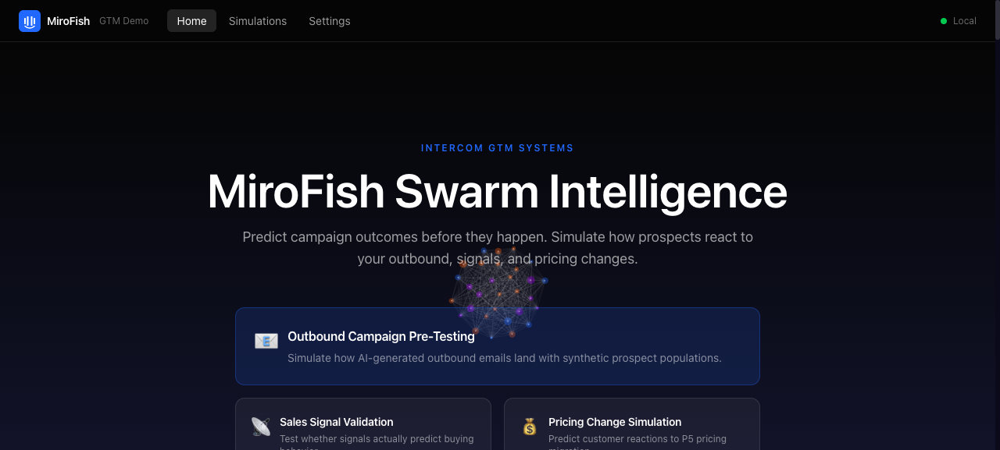
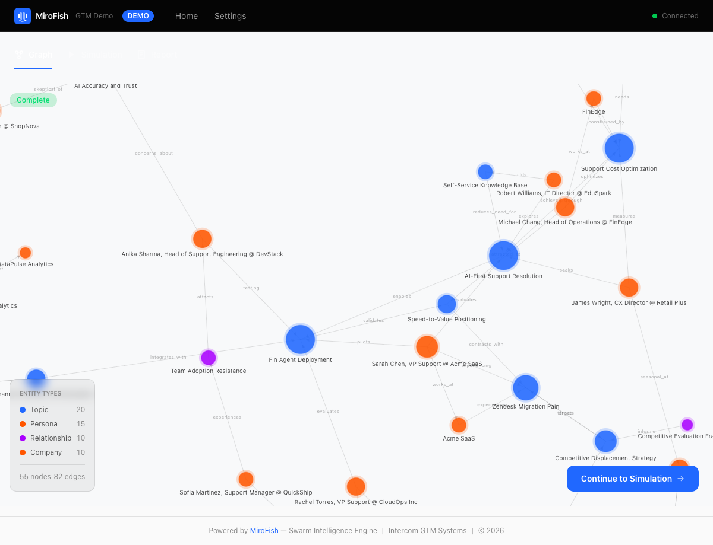

# MiroFish for GTM — Swarm Intelligence Demo

> Predict campaign outcomes before they happen. Simulate how prospects react to your outbound, signals, and pricing changes.

[](LICENSE)
[](https://python.org)
[](https://nodejs.org)
[](docker-compose.yml)

An Intercom-branded fork of [MiroFish](https://github.com/666ghj/MiroFish) — an open-source swarm intelligence engine (40K+ GitHub stars) — customized for Intercom's GTM Systems team. Pre-test automated outbound campaigns, validate sales signals, simulate pricing changes, and optimize personalization before they hit real prospects.

---

## Table of Contents

- [The Problem](#the-problem)
- [The Solution](#the-solution)
- [Screenshots](#screenshots)
- [Features](#features)
- [Quick Start](#quick-start)
- [Running Your First Simulation](#running-your-first-simulation)
- [Troubleshooting](#troubleshooting)
- [Configuration](#configuration)
- [Architecture](#architecture)
- [GTM Scenarios](#gtm-scenarios)
- [Development Guide](#development-guide)
- [Deployment](#deployment)
- [API Reference](#api-reference)
- [Contributing](#contributing)
- [License](#license)
- [Credits](#credits)

---

## The Problem

Intercom's GTM operations face a fundamental challenge: **we can't predict how our outbound messaging, pricing changes, and campaign strategies will land before we execute them.**

| Challenge | Impact |
|-----------|--------|
| Data trust is critically low | Reps spend 5-30 minutes per account validating data |
| 56K incorrect website records | Enrichment accuracy only 25-32% |
| Signal adoption collapsed | 11% unactioned at launch to 76% now |
| No campaign staging environment | Every campaign is a production deployment |
| Churn prediction: 87% recall, 16% precision | Model predicts who, not how to prevent |

## The Solution

MiroFish creates **digital sandboxes** populated with AI agents that simulate real social behavior. Instead of asking "what happened last time?" it answers **"what would happen if we did this?"**

```
Your Scenario (email copy, signals, pricing)
    -> Knowledge Graph Construction (Zep GraphRAG)
        -> Agent Population (hundreds of AI personas)
            -> Social Simulation (Twitter + Reddit, 23 action types)
                -> Predictive Report (evidence-based analysis)
                    -> Interactive Chat (Q&A with simulated world)
```

---

## Screenshots

### Landing Page
Scenario cards with "How It Works" section and key stats.



### Knowledge Graph
D3.js force-directed graph with entity type coloring (Topics, Personas, Relationships, Companies), zoom/pan, and click-to-inspect node details. Built from scenario seed text via Zep GraphRAG.



---

## Features

- **4 Pre-Built GTM Scenarios** — Outbound campaign pre-testing (hero), signal validation, pricing simulation, personalization optimization
- **Multi-LLM Support** — Claude (Anthropic), OpenAI (GPT-4o), Google Gemini — switchable in settings
- **Intercom Branding** — Full Intercom design language with brand colors (#2068FF blue, #050505 navy, #ff5600 Fin orange), typography, and logo
- **Real GTM Seed Data** — Anonymized data from Intercom's actual GTM models (accounts, signals, templates, personas)
- **8 Interactive Views** — Landing, Scenario Builder, Simulation Workspace (Knowledge Graph + Live Simulation tabs), Agent Profile, Report Explorer, Chat, Settings, Simulation History
- **D3.js Knowledge Graphs** — Force-directed graph visualization with entity type coloring, zoom/pan, and click-to-inspect
- **Async Task System** — All long-running operations (graph build, simulation, report gen) return task IDs for progress polling
- **Report Agent** — AI-powered report generation with section-by-section streaming and tool-call logging
- **Agent Interviews** — Chat with individual simulated agents or batch-interview entire populations
- **Optional Auth** — Google OAuth / Okta SSO with @intercom.io email enforcement (toggle via `.env`, disabled by default)
- **Docker Deployment** — Single `docker compose up` for local development

---

## Quick Start

### Prerequisites

- **Docker** (recommended) or:
  - Python 3.11+ (with [uv](https://docs.astral.sh/uv/) or plain venv + pip)
  - Node 18+ with [pnpm](https://pnpm.io/)
- **API Keys:**
  - An LLM API key (Anthropic, OpenAI, or Google)
  - A [Zep Cloud](https://app.getzep.com/) API key (free tier sufficient for PoC)

### Docker (Recommended)

```bash
git clone https://github.com/intercom/gtm-mirofish-demo.git
cd gtm-mirofish-demo
cp .env.example .env
# Edit .env — set LLM_API_KEY and ZEP_API_KEY at minimum
docker compose up -d
```

- **Frontend:** http://localhost:3000
- **Backend:** http://localhost:5001
- **Health check:** http://localhost:5001/api/health

> **Note:** The Docker build uses `demo_app.py` — a lightweight mock backend that serves realistic pre-built data without the heavy camel-ai/PyTorch stack (~150 MB image vs ~5.8 GB). The frontend is built with `VITE_DEMO_MODE=true` by default. For real LLM-powered simulations, use the [Manual Development](#manual-development) setup below.
>
> The Docker health check uses Python `urllib` (not `curl`) because the backend image is `python:3.11-slim`.

### Manual Development

```bash
# 1. Clone and configure
git clone https://github.com/intercom/gtm-mirofish-demo.git
cd gtm-mirofish-demo
cp .env.example .env
# Edit .env — set LLM_API_KEY and ZEP_API_KEY at minimum

# 2. Create required upload directories
mkdir -p backend/uploads/simulations backend/uploads/projects backend/uploads/reports

# 3. Backend (terminal 1) — choose ONE of the approaches below:

# Option A: Using uv (if installed)
cd backend
uv sync
uv run python run.py

# Option B: Using venv + pip
cd backend
python3 -m venv .venv
source .venv/bin/activate
pip install -r requirements.txt
python run.py

# Backend runs on http://localhost:5001

# 4. Frontend (terminal 2)
cd frontend
pnpm install
VITE_DEMO_MODE=false pnpm dev
# Frontend runs on http://localhost:3000
```

> **Proxy:** The Vite dev server automatically proxies all `/api/*` requests to the Flask backend at `http://localhost:5001`, so the frontend and backend work together without CORS issues.
>
> **Demo mode:** Set `VITE_DEMO_MODE=false` (shown above) when running locally so the frontend calls the real backend for simulations instead of using mock data. The `frontend/.env.example` already defaults to `false`.
>
> **Port conflict:** If port 3000 is taken, use `VITE_DEMO_MODE=false pnpm dev --port 3001`.

### Verify Installation

```bash
# Check backend health
curl http://localhost:5001/health
# Expected: {"status":"ok","service":"MiroFish Backend"}

# List available GTM scenarios
curl http://localhost:5001/api/gtm/scenarios
```

---

## Running Your First Simulation

1. **Pick a scenario** — Open http://localhost:3000 and choose one of the four pre-built GTM scenarios from the landing page (Outbound Campaign, Signal Validation, Pricing Change, or Personalization). You can also select **Custom** to upload your own seed text.

2. **Configure the run** — Adjust personas, industries, and agent count on the Scenario Builder page. The defaults are tuned for a quick demo run.

3. **Hit "Run Simulation"** — This kicks off a three-stage pipeline:
   - **Ontology generation** — the LLM extracts entity types and relationships from the seed text
   - **Graph build** — chunks are sent to Zep Cloud to construct a knowledge graph
   - **Simulation** — OASIS spawns AI agents that interact on simulated Twitter/Reddit (23 action types)

4. **Watch progress** — The Workspace view shows real-time progress across the Graph and Simulation tabs. Each stage updates its progress bar as tasks complete.

5. **Explore results** — Once the simulation completes:
   - **Generate a report** — click "Generate Report" to produce an evidence-based predictive analysis (the Report Agent searches the graph + simulation data)
   - **Chat** — use the Chat view to ask questions about the simulated world or interview individual agents

---

## Troubleshooting

### Port conflicts

- **Port 5001 in use** (common on macOS — AirPlay Receiver uses 5001): Disable AirPlay Receiver in System Settings > General > AirDrop & Handoff, or change `BACKEND_PORT` in `.env`.
- **Port 3000 in use**: Run `pnpm dev --port 3001` or change `FRONTEND_PORT` in `.env` for Docker.

### Missing uploads directories

If the backend crashes with a `FileNotFoundError` related to uploads, create the directories:

```bash
mkdir -p backend/uploads/simulations backend/uploads/projects backend/uploads/reports
```

### API key validation errors on startup

The backend validates `LLM_API_KEY` and `ZEP_API_KEY` on startup. If either is missing or set to the placeholder value from `.env.example`, it exits with an error. Double-check your `.env` file has real keys:

```
LLM_API_KEY=sk-ant-...    # not "your-api-key-here"
ZEP_API_KEY=z_...          # not "your-zep-api-key-here"
```

### `ERR_NAME_NOT_RESOLVED` when using Docker frontend directly

The Docker Compose frontend is built with `VITE_API_URL=http://backend:5001/api` — this is the Docker-internal hostname. If you open the frontend container's URL in your browser and see network errors referencing `backend:5001`, that is because `backend` is only resolvable inside the Docker network, not from your host machine.

The Docker frontend uses `serve` to host the static build, and API calls are baked in at build time pointing to the internal Docker hostname. This works correctly within the Docker network (frontend container -> backend container), but the browser runs on the host. For local development with hot-reload, use the [Manual Development](#manual-development) setup where Vite's dev proxy handles `/api` routing to `localhost:5001`.

---

## Configuration

All configuration is via the `.env` file. Copy [.env.example](.env.example) to get started.

### LLM Provider

| Variable | Required | Default | Description |
|----------|----------|---------|-------------|
| `LLM_PROVIDER` | Yes | `anthropic` | LLM provider: `anthropic`, `openai`, or `gemini` |
| `LLM_API_KEY` | Yes | — | API key for the chosen provider |
| `LLM_BASE_URL` | No | Auto-configured | Override the provider's default base URL |
| `LLM_MODEL_NAME` | No | Auto-configured | Override the provider's default model |

Setting `LLM_PROVIDER` auto-configures the base URL and model:

| Provider | Base URL | Default Model |
|----------|----------|---------------|
| `anthropic` | `https://api.anthropic.com/v1/` | `claude-sonnet-4-20250514` |
| `openai` | `https://api.openai.com/v1/` | `gpt-4o` |
| `gemini` | `https://generativelanguage.googleapis.com/v1beta/openai/` | `gemini-2.5-flash` |

### Knowledge Graph

| Variable | Required | Default | Description |
|----------|----------|---------|-------------|
| `ZEP_API_KEY` | Yes | — | [Zep Cloud](https://app.getzep.com/) API key (free tier sufficient for PoC) |

### Authentication (Optional)

| Variable | Required | Default | Description |
|----------|----------|---------|-------------|
| `AUTH_ENABLED` | No | `false` | Enable OAuth login gate |
| `AUTH_PROVIDER` | No | `google` | OAuth provider: `google` or `okta` |
| `AUTH_ALLOWED_DOMAIN` | No | `intercom.io` | Restrict login to this email domain |
| `GOOGLE_CLIENT_ID` | No | — | Google OAuth 2.0 client ID |
| `GOOGLE_CLIENT_SECRET` | No | — | Google OAuth 2.0 client secret |
| `OKTA_ISSUER` | No | — | Okta SSO issuer URL |
| `OKTA_CLIENT_ID` | No | — | Okta client ID |

### Accelerated LLM (Optional)

For parallel processing with a secondary LLM provider:

| Variable | Required | Default | Description |
|----------|----------|---------|-------------|
| `LLM_BOOST_API_KEY` | No | — | Separate LLM key for parallel processing |
| `LLM_BOOST_BASE_URL` | No | — | Base URL for boost provider |
| `LLM_BOOST_MODEL_NAME` | No | — | Model name for boost provider |

### Server

| Variable | Required | Default | Description |
|----------|----------|---------|-------------|
| `BACKEND_PORT` | No | `5001` | Flask backend port |
| `FRONTEND_PORT` | No | `3000` | Vite dev server port |
| `FLASK_DEBUG` | No | `true` | Enable Flask debug mode |
| `SECRET_KEY` | No | `change-me-in-production` | Flask session secret key |

---

## Architecture

```
                          +-----------------------------------------+
                          |              Frontend (Vue 3)            |
                          |  Vite + Tailwind + Pinia + D3.js        |
                          |  Port 3000                              |
                          +---+-----+-----+-----+-----+-----+------+
                              |     |     |     |     |     |
                         /api/graph  |  /api/sim |  /api/report  /api/gtm
                              |     |     |     |     |     |
                          +---v-----v-----v-----v-----v-----v------+
                          |             Backend (Flask)             |
                          |  OASIS Simulation + Zep GraphRAG        |
                          |  Port 5001                              |
                          +-----+-------------+-------------+------+
                                |             |             |
                          +-----v-----+ +----v------+ +----v------+
                          | Zep Cloud | | LLM API   | | GTM Seed  |
                          | (GraphRAG | | Claude /  | | Data      |
                          |  Memory)  | | GPT / Gem | | (JSON)    |
                          +-----------+ +-----------+ +-----------+
```

### Data Flow

```
1. UPLOAD        User selects scenario or uploads custom seed text
                       |
2. GRAPH BUILD   Text -> chunks -> Zep Cloud -> knowledge graph
                       |
3. SIMULATE      Graph entities -> OASIS agent personas
                 Agents interact on simulated Twitter/Reddit (23 action types)
                       |
4. REPORT        Report Agent searches graph + simulation data
                 Generates evidence-based predictive analysis
                       |
5. INTERVIEW     User chats with individual agents or the Report Agent
```

### Request Flow

All long-running operations follow the same async pattern:

```
Client                         Server
  |-- POST /api/*/start -------->|  (returns task_id immediately)
  |                              |  [background thread starts]
  |-- GET /api/*/status -------->|  (poll for progress)
  |<-------- {progress: 45%} ----|
  |-- GET /api/*/status -------->|
  |<-------- {status: complete} -|
  |-- GET /api/*/result -------->|  (fetch completed data)
```

### Tech Stack

| Component | Technology |
|-----------|-----------|
| Frontend | Vue 3.5 + Vite 8 + Tailwind CSS 4 + Pinia 3 + Vue Router 4 |
| Visualization | D3.js v7 (force-directed knowledge graphs) |
| Markdown | Marked 17 (report rendering) |
| HTTP Client | Axios 1.13 |
| Backend | Flask 3.0+ (Python 3.11+) |
| Simulation | OASIS (camel-oasis 0.2.5) — up to 1M agents |
| AI Framework | CAMEL-AI 0.2.78 (multi-agent orchestration) |
| Memory | Zep Cloud 3.13 (temporal knowledge graphs) |
| LLM | Any OpenAI-compatible API (via openai SDK) |
| File Processing | PyMuPDF (PDF), charset-normalizer (encoding) |
| Validation | Pydantic 2.0+ |
| Auth | Google OAuth / Okta SSO (optional) |
| Package Mgmt | uv (Python), pnpm (Node) |
| Deploy | Docker Compose |

---

## GTM Scenarios

Four pre-built scenarios ship in `backend/gtm_scenarios/`. Each includes seed text, agent persona definitions, simulation configuration, and expected output types.

### 1. Outbound Campaign Pre-Testing (Hero)

Simulate how AI-generated outbound emails land with synthetic prospect populations.

- **Agent count:** 200 personas (VP of Support, CX Director, IT Leader, Head of Operations)
- **Seeds:** Email copy, target segment description, firmographic data
- **Tests:** 4 subject line variants
- **Key outputs:** Engagement prediction by persona, subject line effectiveness, objection mapping by industry, optimal cadence

### 2. Sales Signal Validation

Test whether sales signals actually predict buying behavior.

- **Agent count:** 500 personas across 5 decision-making roles
- **Seeds:** 8 signal definitions from Intercom's DBT models
- **Signals tested:** Product Usage Surge, Competitor Research, Feature Exploration, Contract Approaching, Expansion Indicator, Champion Change, Technographic Match, Third-Party Intent
- **Key outputs:** Signal-to-buying correlation, false positive rates, recommended signal priority ranking

### 3. Pricing Change Simulation

Predict customer reactions to P5 pricing migration.

- **Agent count:** 500 customer personas (SMB / Mid-Market / Enterprise)
- **Seeds:** 4 pricing scenarios and customer segment mix
- **Tests:** 4 pricing scenarios
- **Key outputs:** Churn probability by segment, public sentiment risk, competitive switch likelihood, optimal migration strategy

### 4. Personalization Optimization

Rank email personalization variants by simulated engagement.

- **Agent count:** 200 personas
- **Seeds:** 10 message variants across dimensions (tone, length, personalization depth, CTA style)
- **Key outputs:** Variant ranking by segment, most impactful personalization dimensions, segment-specific recommendations

### Seed Data

Anonymized GTM data is provided in `backend/gtm_seed_data/`:

| File | Contents |
|------|----------|
| `account_profiles.json` | 4 company profiles with segment, industry, ARR, health score, churn risk |
| `persona_templates.json` | 4 buyer personas with role, priorities, objections, communication style |
| `signal_definitions.json` | 8 sales signal types with accuracy and adoption metrics |
| `email_templates.json` | 3 outbound email templates (ROI pitch, case study, competitive displacement) |

---

## Development Guide

### Project Structure

```
gtm-mirofish-demo/
├── backend/                    # Flask backend (MiroFish fork)
│   ├── app/
│   │   ├── __init__.py         # Flask app factory, blueprint registration
│   │   ├── config.py           # Multi-LLM provider configuration
│   │   ├── api/
│   │   │   ├── graph.py        # Knowledge graph CRUD + build routes
│   │   │   ├── simulation.py   # OASIS simulation lifecycle routes
│   │   │   ├── report.py       # Report generation + chat routes
│   │   │   ├── settings.py     # Settings and config routes
│   │   │   └── gtm_scenarios.py # GTM scenario template API
│   │   ├── models/             # Project + task persistence
│   │   ├── services/           # Core business logic (READ-ONLY)
│   │   └── utils/
│   │       ├── llm_client.py   # Multi-provider LLM abstraction
│   │       ├── file_parser.py  # PDF/MD/TXT file processing
│   │       ├── logger.py       # Logging configuration
│   │       ├── retry.py        # Retry logic decorator
│   │       └── zep_paging.py   # Zep pagination utilities
│   ├── auth/                   # OAuth middleware (Google/Okta)
│   ├── gtm_scenarios/          # Pre-built scenario JSON files
│   ├── gtm_seed_data/          # Anonymized GTM data
│   ├── scripts/                # Utility scripts for direct simulation
│   ├── demo_app.py             # Lightweight mock server for Docker/demos
│   ├── run.py                  # Backend entry point
│   └── pyproject.toml          # Python dependencies (uv)
├── frontend/                   # Vue 3 frontend (complete rebuild)
│   ├── src/
│   │   ├── api/
│   │   │   ├── client.js       # Axios base client with error normalization
│   │   │   ├── graph.js        # Knowledge graph API calls
│   │   │   ├── simulation.js   # Simulation lifecycle API calls
│   │   │   ├── report.js       # Report generation API calls
│   │   │   ├── scenarios.js    # GTM scenario API calls
│   │   │   └── chat.js         # Chat/interview API calls
│   │   ├── assets/
│   │   │   └── brand-tokens.css # Intercom design tokens (CSS variables)
│   │   ├── components/
│   │   │   ├── common/         # Reusable UI primitives (Button, Card, Modal, etc.)
│   │   │   ├── layout/         # AppLayout, AppNav, AppFooter
│   │   │   ├── simulation/     # GraphPanel, SimulationPanel, SentimentTimeline
│   │   │   ├── report/         # ReportCharts
│   │   │   ├── demo/           # PresenterToolbar (demo mode)
│   │   │   ├── landing/        # HeroSwarm animation
│   │   │   └── ui/             # ConfirmDialog, EmptyState, LoadingSpinner, etc.
│   │   ├── composables/        # Vue composition functions (reusable logic)
│   │   ├── stores/             # Pinia state management
│   │   ├── views/              # 8 route-level page components
│   │   └── router/             # Vue Router configuration
│   ├── package.json
│   └── vite.config.js          # Proxy /api -> backend:5001
├── docs/
│   ├── scenarios/              # GTM scenario documentation (4 guides)
│   └── screenshots/            # Application screenshots
├── docker-compose.yml          # Two-service Docker setup
└── .env.example                # All environment variables
```

### Frontend Development

The frontend is a complete Vue 3 rebuild with Intercom branding.

```bash
cd frontend
pnpm install
pnpm dev          # Dev server on http://localhost:3000
pnpm build        # Production build to dist/
pnpm preview      # Preview production build
```

The Vite dev server proxies all `/api` requests to `http://localhost:5001` (configurable via `BACKEND_URL` env var).

**Conventions:**
- All components use Composition API with `<script setup>`
- Tailwind CSS v4 via `@tailwindcss/vite` plugin — no `tailwind.config.js`; design tokens live in `src/assets/brand-tokens.css` as CSS variables
- API requests go through modules in `src/api/` which build on the shared Axios client in `src/api/client.js`
- State management via Pinia stores in `src/stores/`
- Reusable logic via composables in `src/composables/`
- Routing via Vue Router with lazy-loaded views for code splitting

**Composables** (`src/composables/`):

| Composable | Purpose |
|------------|---------|
| `useDemoMode` | Demo mode state — controls mock data vs real backend |
| `useSimulationPolling` | Long-polling for simulation/graph/report progress |
| `useTheme` | Dark/light theme management |
| `useToast` | Toast notification system |
| `useCountUp` | Animated number counting for stats |
| `useIntercom` | Intercom widget integration |

**Pinia Stores** (`src/stores/`):

| Store | Purpose |
|-------|---------|
| `auth` | Authentication state (login, user, permissions) |
| `scenarios` | Scenario list and current scenario selection |
| `settings` | App settings (LLM provider, theme) |
| `simulation` | Current simulation state (task ID, phases, data) |
| `toast` | Toast notification queue |

**API Client** (`src/api/`):

The frontend uses a modular API layer built on Axios. `client.js` creates a shared instance with `baseURL` from `VITE_API_URL` (defaults to `/api`) and a response interceptor that normalizes errors to `{ message, status, data }`. Domain-specific modules (`graph.js`, `simulation.js`, `report.js`, `scenarios.js`, `chat.js`) export functions that use this client.

**Frontend Views:**

| Route | View | Purpose |
|-------|------|---------|
| `/` | LandingView | Scenario cards, "How It Works" section |
| `/scenarios/:id` | ScenarioBuilderView | Configure and launch a simulation |
| `/workspace/:taskId` | SimulationWorkspaceView | Unified tabbed workspace (Graph + Simulation) |
| `/workspace/:taskId/agent/:agentId` | AgentProfileView | Individual agent persona detail and interview |
| `/simulations` | SimulationsView | Persistent simulation history with search/filter |
| `/report/:taskId` | ReportView | Multi-chapter report explorer |
| `/chat/:taskId` | ChatView | Q&A with simulated world |
| `/settings` | SettingsView | LLM provider, API keys, theme |

> **Redirects:** `/graph/:taskId` and `/simulation/:taskId` redirect to `/workspace/:taskId` with the appropriate tab. `/dashboard` redirects to `/simulations`. All routes use lazy loading for code splitting.

**Intercom Design Tokens:**
- Primary blue: `#2068FF`
- Navy: `#050505`
- Fin orange: `#ff5600`
- Accent purple: `#A0F`
- Success green: `#090`
- Font: system-ui stack (Segoe UI, Roboto, Helvetica, Arial)

### Backend Development

The backend is a minimally patched fork of the MiroFish Flask server.

```bash
cd backend
uv sync             # Install dependencies
uv run python run.py # Start on http://localhost:5001
```

The backend validates `LLM_API_KEY` and `ZEP_API_KEY` on startup. If either is missing, it exits with an error.

**Conventions:**
- Services in `app/services/` are **read-only** — do not modify
- New GTM-specific routes go in `app/api/gtm_scenarios.py`
- All LLM calls go through `app/utils/llm_client.py` (multi-provider abstraction)
- Configuration is resolved via `app/config.py` from `.env`
- All routes return JSON with `{success: bool, data: ..., error: ...}` shape
- Async operations return a `task_id` for polling via `/api/graph/task/<task_id>`

### Running with Docker

```bash
# Build and start both services
docker compose up -d

# View logs
docker compose logs -f

# Rebuild after code changes
docker compose up -d --build

# Stop
docker compose down
```

The Docker setup uses a named volume for `backend/uploads` to persist simulation data across container restarts.

### Running Tests

```bash
# Backend
cd backend
uv run pytest

# Frontend
cd frontend
pnpm test          # If test runner is configured
```

---

## Deployment

This project is designed to run locally or in any Docker-compatible environment. See [Quick Start](#quick-start) for setup instructions.

---

## API Reference

All endpoints are prefixed with `/api`. The backend registers four blueprint groups.

### Health Check

| Method | Endpoint | Description |
|--------|----------|-------------|
| GET | `/health` | Returns `{status: "ok", service: "MiroFish Backend"}` |

### Graph (`/api/graph`)

Project and knowledge graph management.

| Method | Endpoint | Description |
|--------|----------|-------------|
| POST | `/api/graph/ontology/generate` | Upload files (PDF/MD/TXT) and generate entity/edge ontology |
| POST | `/api/graph/build` | Start async knowledge graph build from a project |
| GET | `/api/graph/project/<project_id>` | Get project details |
| GET | `/api/graph/project/list` | List all projects |
| DELETE | `/api/graph/project/<project_id>` | Delete a project |
| POST | `/api/graph/project/<project_id>/reset` | Reset project state for rebuild |
| GET | `/api/graph/task/<task_id>` | Get async task status and progress |
| GET | `/api/graph/tasks` | List all tasks |
| GET | `/api/graph/data/<graph_id>` | Get graph nodes and edges |
| DELETE | `/api/graph/delete/<graph_id>` | Delete a Zep graph |

### Simulation (`/api/simulation`)

Simulation lifecycle, agent management, and interview system.

**Lifecycle:**

| Method | Endpoint | Description |
|--------|----------|-------------|
| POST | `/api/simulation/create` | Create a new simulation |
| POST | `/api/simulation/prepare` | Prepare simulation environment (async, LLM generates config) |
| POST | `/api/simulation/prepare/status` | Check preparation task progress |
| POST | `/api/simulation/start` | Start running the simulation |
| POST | `/api/simulation/stop` | Stop a running simulation |
| GET | `/api/simulation/<simulation_id>` | Get simulation state |
| GET | `/api/simulation/list` | List all simulations |
| GET | `/api/simulation/history` | Get simulation history with project details |

**Entities & Profiles:**

| Method | Endpoint | Description |
|--------|----------|-------------|
| GET | `/api/simulation/entities/<graph_id>` | Get all entities from a graph |
| GET | `/api/simulation/entities/<graph_id>/<entity_uuid>` | Get single entity detail |
| GET | `/api/simulation/entities/<graph_id>/by-type/<type>` | Get entities filtered by type |
| POST | `/api/simulation/generate-profiles` | Generate OASIS agent profiles from graph |
| GET | `/api/simulation/<sim_id>/profiles` | Get simulation agent profiles |
| GET | `/api/simulation/<sim_id>/profiles/realtime` | Realtime profile generation progress |
| GET | `/api/simulation/<sim_id>/config` | Get LLM-generated simulation config |
| GET | `/api/simulation/<sim_id>/config/realtime` | Realtime config generation progress |
| GET | `/api/simulation/<sim_id>/config/download` | Download simulation config file |
| GET | `/api/simulation/script/<name>/download` | Download simulation run script |

**Runtime & Data:**

| Method | Endpoint | Description |
|--------|----------|-------------|
| GET | `/api/simulation/<sim_id>/run-status` | Realtime simulation run status |
| GET | `/api/simulation/<sim_id>/run-status/detail` | Detailed run status with all actions |
| GET | `/api/simulation/<sim_id>/actions` | Agent action history |
| GET | `/api/simulation/<sim_id>/timeline` | Round-by-round timeline |
| GET | `/api/simulation/<sim_id>/agent-stats` | Per-agent statistics |
| GET | `/api/simulation/<sim_id>/posts` | Simulated posts (Twitter/Reddit) |
| GET | `/api/simulation/<sim_id>/comments` | Simulated comments (Reddit) |

**Interviews:**

| Method | Endpoint | Description |
|--------|----------|-------------|
| POST | `/api/simulation/interview` | Interview a single agent |
| POST | `/api/simulation/interview/batch` | Batch interview multiple agents |
| POST | `/api/simulation/interview/all` | Interview all agents with same question |
| POST | `/api/simulation/interview/history` | Get interview history |
| POST | `/api/simulation/env-status` | Check if simulation env is alive |
| POST | `/api/simulation/close-env` | Gracefully close simulation env |

### Report (`/api/report`)

Report generation, retrieval, and analysis chat.

| Method | Endpoint | Description |
|--------|----------|-------------|
| POST | `/api/report/generate` | Generate predictive report (async) |
| POST | `/api/report/generate/status` | Check report generation progress |
| GET | `/api/report/<report_id>` | Get completed report |
| GET | `/api/report/by-simulation/<sim_id>` | Get report by simulation ID |
| GET | `/api/report/list` | List all reports |
| GET | `/api/report/<report_id>/download` | Download report as Markdown |
| DELETE | `/api/report/<report_id>` | Delete a report |
| POST | `/api/report/chat` | Chat with Report Agent (Q&A with simulated world) |
| GET | `/api/report/check/<sim_id>` | Check if simulation has a report |
| GET | `/api/report/<report_id>/progress` | Realtime report generation progress |
| GET | `/api/report/<report_id>/sections` | Get generated sections (incremental) |
| GET | `/api/report/<report_id>/section/<index>` | Get single section content |
| GET | `/api/report/<report_id>/agent-log` | Report Agent execution log |
| GET | `/api/report/<report_id>/agent-log/stream` | Full agent log (one-shot) |
| GET | `/api/report/<report_id>/console-log` | Console output log |
| GET | `/api/report/<report_id>/console-log/stream` | Full console log (one-shot) |
| POST | `/api/report/tools/search` | Graph search tool (debug) |
| POST | `/api/report/tools/statistics` | Graph statistics tool (debug) |

### GTM Extensions (`/api/gtm`)

Pre-built GTM scenario templates and seed data.

| Method | Endpoint | Description |
|--------|----------|-------------|
| GET | `/api/gtm/scenarios` | List all GTM scenario templates |
| GET | `/api/gtm/scenarios/<scenario_id>` | Get scenario with full configuration |
| GET | `/api/gtm/scenarios/<scenario_id>/seed-text` | Get ready-to-use seed text for graph building |
| GET | `/api/gtm/seed-data/<data_type>` | Get seed data by type (`account_profiles`, `signal_definitions`, `email_templates`, `persona_templates`) |

---

## Contributing

### Getting Started

1. Fork the repository
2. Create a feature branch: `git checkout -b feature/your-feature`
3. Follow the [Development Guide](#development-guide) to set up your environment
4. Make your changes

### Guidelines

- **Backend services are read-only** — `backend/app/services/` contains the core MiroFish simulation logic and should not be modified
- **Frontend uses Composition API** — All Vue components must use `<script setup>` syntax
- **Use Intercom brand tokens** — Reference `frontend/src/assets/brand-tokens.css` for colors and spacing (primary blue `#2068FF`, navy `#050505`, fin orange `#ff5600`, accent purple `#A0F`)
- **Use pnpm** for frontend package management (not npm or yarn)
- **Use uv** for backend package management
- **API responses** follow the `{success: bool, data: ..., error: ...}` convention
- **API routes** — All frontend API requests use the `/api` prefix, which Vite proxies to the Flask backend
- Keep commits focused — one logical change per commit

### Submitting Changes

1. Ensure your code follows existing patterns and conventions
2. Test your changes locally (both Docker and manual setups)
3. Submit a pull request with a clear description of what changed and why

---

## License

AGPL-3.0 — inherited from [MiroFish](https://github.com/666ghj/MiroFish). See [LICENSE](LICENSE).

---

## Credits

- **[MiroFish](https://github.com/666ghj/MiroFish)** by Shanda Group — the swarm intelligence engine powering this demo
- **[OASIS](https://github.com/camel-ai/oasis)** — social simulation framework (up to 1M agents)
- **[Zep Cloud](https://www.getzep.com/)** — temporal knowledge graph memory
- **Intercom GTM Systems Team** — Spenser Wellen, Spencer Cross, Bil Erdenekhuyag
