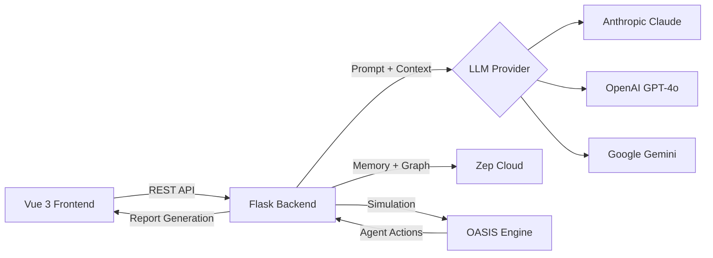

<!--
  ╔══════════════════════════════════════════════════════════════╗
  ║  MiroFish GTM Demo — Presentation Deck                     ║
  ║  Format: Marp (https://marp.app)                           ║
  ╚══════════════════════════════════════════════════════════════╝

  HOW TO PRESENT
  ──────────────
  1. Install Marp CLI (one-time):
       npm install -g @marp-team/marp-cli

  2. Generate HTML slides:
       npx @marp-team/marp-cli demo-deck.md --html

  3. Generate PDF:
       npx @marp-team/marp-cli demo-deck.md --html --pdf

  4. Live preview with hot-reload:
       npx @marp-team/marp-cli -s demo-deck.md --html

  5. Presenter mode (shows speaker notes):
       Open the HTML output in a browser and press "P"

  Notes:
  - The  --html  flag is required for Mermaid diagrams and speaker notes.
  - Screenshots referenced in this deck are placeholders. Replace the
    image paths with actual screenshots from docs/screenshots/.
  - Mermaid diagrams render natively in Marp with the --html flag.
-->

---
marp: true
theme: default
paginate: true
style: |
  section {
    font-family: system-ui, -apple-system, "Segoe UI", Roboto, sans-serif;
    color: #1a1a1a;
  }
  h1 {
    color: #2068FF;
  }
  h2 {
    color: #050505;
  }
  a {
    color: #2068FF;
  }
  code {
    background: #f0f4ff;
    color: #2068FF;
    padding: 2px 6px;
    border-radius: 4px;
  }
  blockquote {
    border-left: 4px solid #2068FF;
    padding-left: 16px;
    color: #555;
  }
  section.lead h1 {
    font-size: 2.4em;
    color: #2068FF;
  }
  section.lead h2 {
    color: #555;
    font-weight: 400;
  }
  footer {
    color: #888;
    font-size: 0.65em;
  }
  table th {
    background: #2068FF;
    color: #fff;
  }
  .orange { color: #ff5600; }
  .blue { color: #2068FF; }
  .navy { color: #050505; }
  .muted { color: #888; }
---

<!-- _class: lead -->

# MiroFish

## Swarm Intelligence for GTM Strategy

**Multi-agent simulation** that predicts how buyers, sellers, and market forces interact — before you go to market.

Built for Intercom GTM teams.

<!-- Speaker notes:
Welcome everyone. MiroFish is a swarm intelligence engine that lets GTM teams simulate real market scenarios using AI agents. Instead of relying on intuition or historical data alone, you can run hundreds of simulated agents through a scenario and observe emergent behavior patterns before committing resources.
-->

---

# The Problem

### GTM teams operate on intuition and siloed data

- **Campaign planning is slow** — weeks of cross-team alignment before launch
- **Pricing decisions are risky** — limited ability to model buyer reactions at scale
- **Signal overload** — too many intent signals, no way to validate which actually predict buying
- **Post-mortems, not pre-mortems** — teams learn what went wrong after the fact

> *"We spent 6 weeks planning the outbound campaign. It underperformed by 40%. We never tested our assumptions."*

<!-- Speaker notes:
This is the fundamental problem. GTM decisions — pricing changes, outbound campaigns, signal prioritization — are typically made based on gut feel and small-sample A/B tests. By the time you learn the outcome, you've already committed budget and headcount. MiroFish flips this: simulate first, then execute with confidence.
-->

---

# The Solution

### AI agents simulate buyer behavior at scale

| What | How |
|------|-----|
| **Realistic agents** | LLM-powered personas with distinct roles, firmographics, and decision styles |
| **Market dynamics** | Agents influence each other — coalitions form, sentiment shifts, consensus emerges |
| **Knowledge graphs** | Zep-backed memory gives agents persistent context across rounds |
| **Predictive reports** | AI-generated analysis of simulation outcomes with actionable recommendations |

**Result:** Run a scenario in minutes. Get insights that would take months of real-world observation.

<!-- Speaker notes:
MiroFish uses the OASIS framework to create realistic multi-agent simulations. Each agent is an LLM-backed persona — a VP of Sales, a Technical Evaluator, a Budget Holder — that behaves according to its role and context. Agents interact with each other over multiple rounds, forming opinions, coalitions, and ultimately decisions. The knowledge graph (powered by Zep) gives agents memory, so their positions evolve over time rather than being stateless.
-->

---

# Architecture

<div style="text-align: center; font-size: 0.85em;">



</div>

- **Frontend:** Vue 3 + Vite + Tailwind — Intercom-branded UI
- **Backend:** Flask + multi-LLM client — swap providers via env var
- **Simulation:** OASIS multi-agent framework with configurable rounds
- **Memory:** Zep Cloud for knowledge graph persistence

<!-- Speaker notes:
The architecture is designed for flexibility. The LLM provider is configurable — switch between Claude, GPT-4o, or Gemini with a single environment variable. The frontend is a full Vue 3 rebuild with Intercom design tokens. Zep Cloud provides the knowledge graph that agents use for persistent memory. Everything runs in Docker for easy deployment.
-->

---

# How It Works

### Four steps from scenario to insight

```
┌─────────────┐    ┌─────────────┐    ┌──────────────┐    ┌─────────────┐
│  1. SCENARIO │───▶│  2. GRAPH   │───▶│ 3. SIMULATE  │───▶│  4. REPORT  │
│              │    │              │    │              │    │             │
│  Select or   │    │  Build a     │    │  Agents      │    │ AI-powered  │
│  create a    │    │  knowledge   │    │  interact    │    │ analysis of │
│  GTM scenario│    │  graph from  │    │  over 144    │    │ outcomes +  │
│  template    │    │  seed data   │    │  rounds      │    │ predictions │
└─────────────┘    └─────────────┘    └──────────────┘    └─────────────┘
```

Each step feeds the next. The knowledge graph provides agent context. The simulation produces behavioral data. The report synthesizes insights.

<!-- Speaker notes:
Walk the audience through each step. Step 1: Choose from pre-built GTM scenarios or create your own with custom seed text. Step 2: The system builds a knowledge graph from the seed data using Zep — this becomes the shared context for all agents. Step 3: The OASIS simulation runs agents through 144 rounds (configurable), where they post opinions, reply to each other, and shift positions. Step 4: An AI report agent analyzes the full simulation output and generates a structured report with visualizations and recommendations.
-->

---

# Pre-Built GTM Scenarios

| Scenario | What It Tests |
|----------|---------------|
| **Sales Signal Validation** | Which intent signals actually predict buying behavior across 500 simulated accounts? |
| **Outbound Campaign Pre-Testing** | How will different buyer personas respond to outbound messaging strategies? |
| **Pricing Change Simulation** | What happens when you change pricing tiers? Model churn, expansion, and competitive switching. |
| **Personalization Optimization** | Test personalization strategies across segments before committing engineering resources. |

Each scenario includes curated seed data, agent persona configurations, and expected output metrics.

<!-- Speaker notes:
These four scenarios are pre-built and ready to demo. Signal Validation is the most complex — it simulates 500 accounts with varying signal exposure. Pricing Simulation is the most visually dramatic because you can see coalition formation around pricing positions. For the live demo, I recommend starting with Outbound Campaign Pre-Testing since it runs fastest and has clear visual outcomes.
-->

---

# Knowledge Graph

### Agents share context through a persistent knowledge graph


- Entities extracted from seed data (companies, personas, products, signals)
- Relationships modeled as edges (influences, competes with, evaluates)
- Agents query the graph during simulation for context
- Graph updates as agents generate new information

**Powered by Zep Cloud** — production-grade graph memory for LLM applications.

<!-- Speaker notes:
The knowledge graph is what makes MiroFish different from simple LLM chat. Instead of stateless prompting, agents have access to a structured knowledge base. When Agent A (a VP of Sales) is deciding whether to act on a signal, they can query the graph for that account's history, related accounts, and what other agents have said about similar signals. This produces much more realistic behavior than isolated LLM calls.
-->

---

# Simulation in Action

### Watch agents interact in real-time


**What you'll see:**

- 🔄 **Live activity feed** — agent posts, replies, and reactions
- 📊 **Round-by-round progress** — sentiment and engagement over time
- 🤝 **Coalition detection** — groups of agents that align on positions
- 🎯 **Competitive mentions** — tracking references to Zendesk, Freshdesk, HubSpot, etc.

Simulations run 144 rounds. Each round represents 30 minutes of simulated time (3 days total).

<!-- Speaker notes:
During the simulation, the frontend shows a live activity feed as agents post and interact. You'll see coalitions form naturally — for example, technical evaluators might align against a pricing change while decision makers support it. The sentiment tracking shows how positions evolve over rounds. Competitive mentions are tracked automatically so you can see when and why agents bring up competitors.
-->

---

# Report Insights

### AI-generated analysis of simulation outcomes

Reports are generated by a ReACT agent that:

1. **Analyzes** all agent interactions across 144 rounds
2. **Identifies** key themes, coalitions, and decision patterns
3. **Generates** structured chapters with data visualizations
4. **Recommends** actions based on simulated outcomes

**Report sections include:**
- Executive summary with key findings
- Agent behavior analysis and sentiment trends
- Coalition formation and influence networks
- Competitive landscape from agent discussions
- Actionable recommendations with confidence levels

<!-- Speaker notes:
The report agent uses the ReACT pattern — it reasons about the simulation data, selects analysis tools, and generates structured chapters. It has access to sentiment analysis, competitive tracking, influence network data, and heatmap data from the simulation. The output is a multi-chapter markdown report that can be downloaded. Each section includes data from actual simulation endpoints, not hallucinated content.
-->

---

# Key Metrics

### What the simulation measures

<div style="display: grid; grid-template-columns: 1fr 1fr 1fr; gap: 20px; text-align: center; margin-top: 30px;">
<div>

### 📈 Engagement
**Activity density** per agent per round
**Reply rates** and interaction depth
**Topic adoption** velocity

</div>
<div>

### 💬 Sentiment
**Per-agent** sentiment tracking (-1.0 to 1.0)
**Shift patterns** over time
**Consensus** detection

</div>
<div>

### 🏆 Influence
**Agent-to-agent** influence graph
**Coalition** formation
**Competitive** mention tracking

</div>
</div>

All metrics are derived from simulation data and visualized with **D3.js** interactive charts.

<!-- Speaker notes:
These aren't vanity metrics — they map directly to GTM questions. Engagement density tells you which persona types are most responsive. Sentiment tracking shows whether your messaging moves opinions in the right direction. Influence graphs reveal who the key decision-makers are and how information flows through a buying committee. Coalition detection shows you where consensus forms and where resistance lives.
-->

---

# Demo Walkthrough

### What to show in a live demo

| Step | Action | Time |
|------|--------|------|
| 1 | Open landing page — show Intercom branding | 30s |
| 2 | Browse scenario templates — highlight pre-built GTM scenarios | 1 min |
| 3 | Select **Outbound Campaign Pre-Testing** | 30s |
| 4 | Review seed data and agent configuration | 1 min |
| 5 | Launch simulation — watch agents interact live | 3 min |
| 6 | Explore knowledge graph visualization | 1 min |
| 7 | Show sentiment + competitive tracking charts | 1 min |
| 8 | Generate AI report from simulation results | 2 min |
| 9 | Download and review report | 1 min |
| 10 | Chat with the simulated world | 1 min |

**Total: ~12 minutes.** Demo mode works without LLM keys for reliable presentations.

<!-- Speaker notes:
This is the recommended demo flow. Start with the landing page to establish branding. Move through scenario selection to show the template system. The simulation is the centerpiece — let it run for a minute or two so the audience can see agents interacting. Then jump to the report. Pro tip: use demo mode (VITE_DEMO_MODE=true) for presentations — it generates deterministic synthetic data so you don't depend on LLM API availability.
-->

---

# Roadmap

### Where MiroFish is headed

**Near-term:**
- <span class="blue">●</span> Real-time WebSocket updates (replace polling)
- <span class="blue">●</span> Custom dashboard builder with drag-and-drop widgets
- <span class="blue">●</span> Export simulations as shareable links

**Mid-term:**
- <span class="orange">●</span> Multi-simulation comparison (A/B test scenarios)
- <span class="orange">●</span> CRM integration — pull real account data as seed input
- <span class="orange">●</span> Agent personality fine-tuning from historical win/loss data

**Long-term:**
- <span class="navy">●</span> Continuous simulation — agents run in background and alert on shifts
- <span class="navy">●</span> API-first mode — embed simulations in existing GTM workflows
- <span class="navy">●</span> Multi-tenant deployment for broader Intercom team access

<!-- Speaker notes:
The roadmap is designed to increase MiroFish's integration with real GTM workflows. Near-term work focuses on polish and real-time UX. Mid-term is about making simulations more grounded in real data by pulling from CRMs. Long-term vision is continuous background simulation that proactively alerts GTM teams when market dynamics shift — like a weather forecast for your pipeline.
-->

---

<!-- _class: lead -->

# Questions?

<br>

**Try it yourself:**
```
git clone <repo-url>
cp .env.example .env
docker compose up -d
```

Open `http://localhost:3000` — no LLM key required for demo mode.

<br>

<span class="muted">Built with Vue 3 · Flask · OASIS · Zep · Claude/GPT-4o/Gemini</span>

<!-- Speaker notes:
Open the floor for questions. Key talking points if asked: Yes, it works without an LLM key in demo mode. Yes, you can bring your own LLM provider. The simulation engine is based on OASIS, an open-source multi-agent framework. Zep Cloud provides the knowledge graph. The whole thing runs in Docker and deploys to Railway in minutes.
-->
